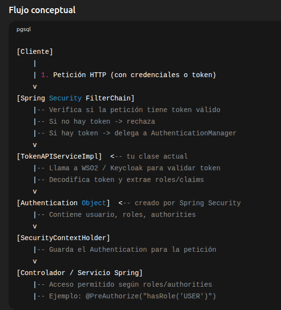

Elementos clave:
- Cliente: Puede enviar usuario/contraseña (para login) o token (para llamadas autenticadas).
- Spring Security FilterChain: Filtro que intercepta todas las peticiones y verifica autenticación.
- TokenAPIServiceImpl: Tu servicio, ahora usado para validar y decodificar tokens.
- Authentication Object: Representa la identidad del usuario en Spring Security.
- SecurityContextHolder: Mantiene la información de seguridad durante la petición.
- Controlador/Servicios: Protegidos por roles y permisos.